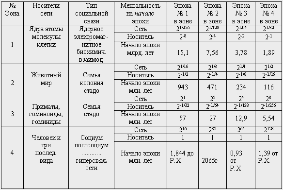
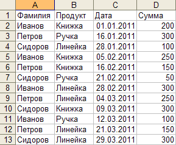
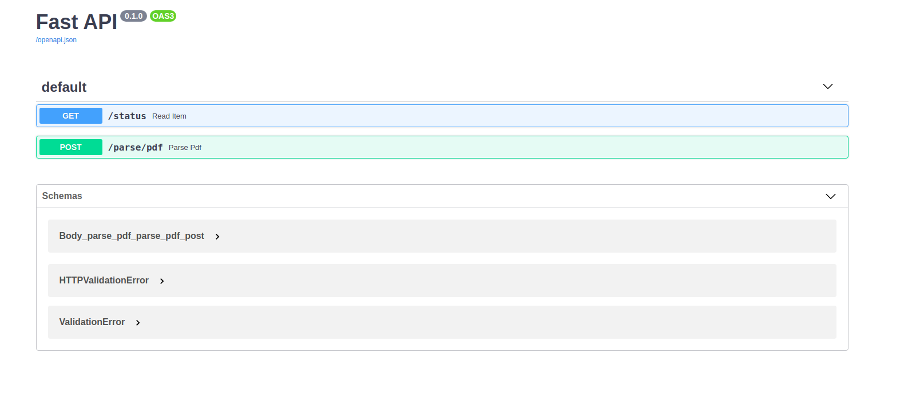
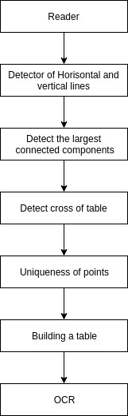
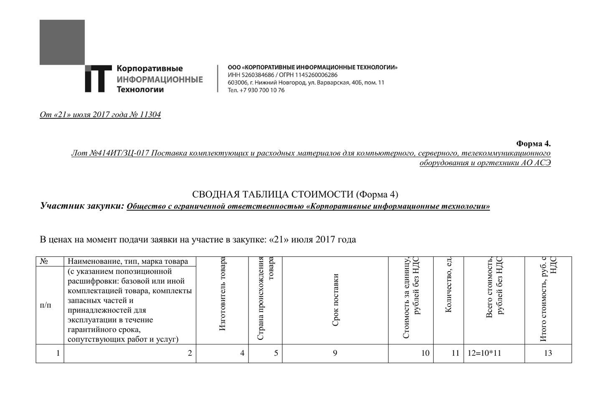
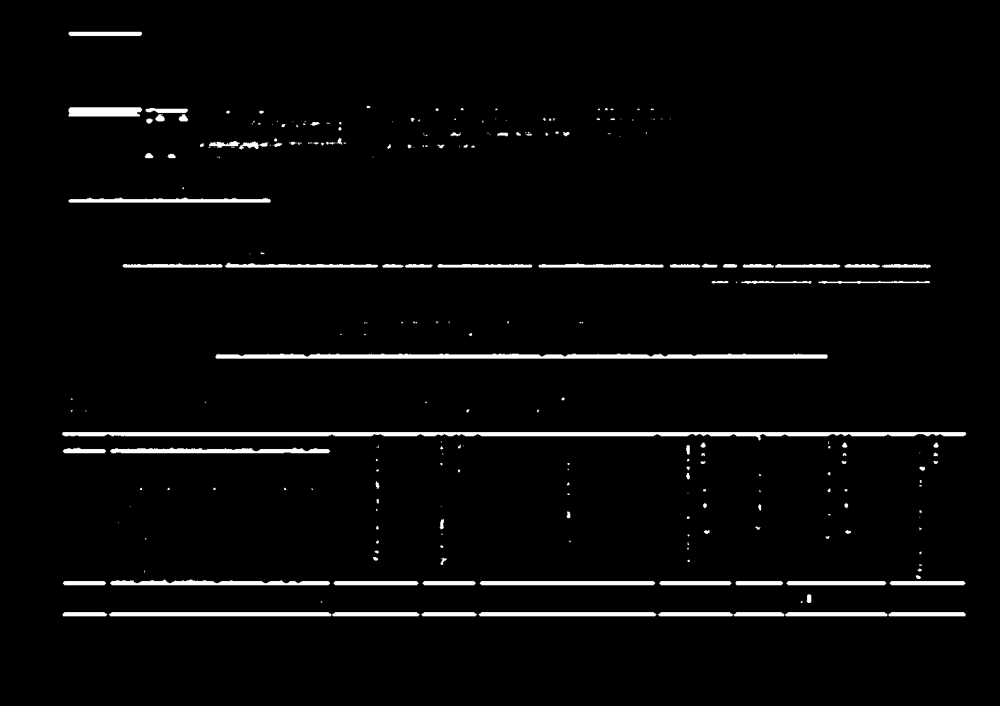
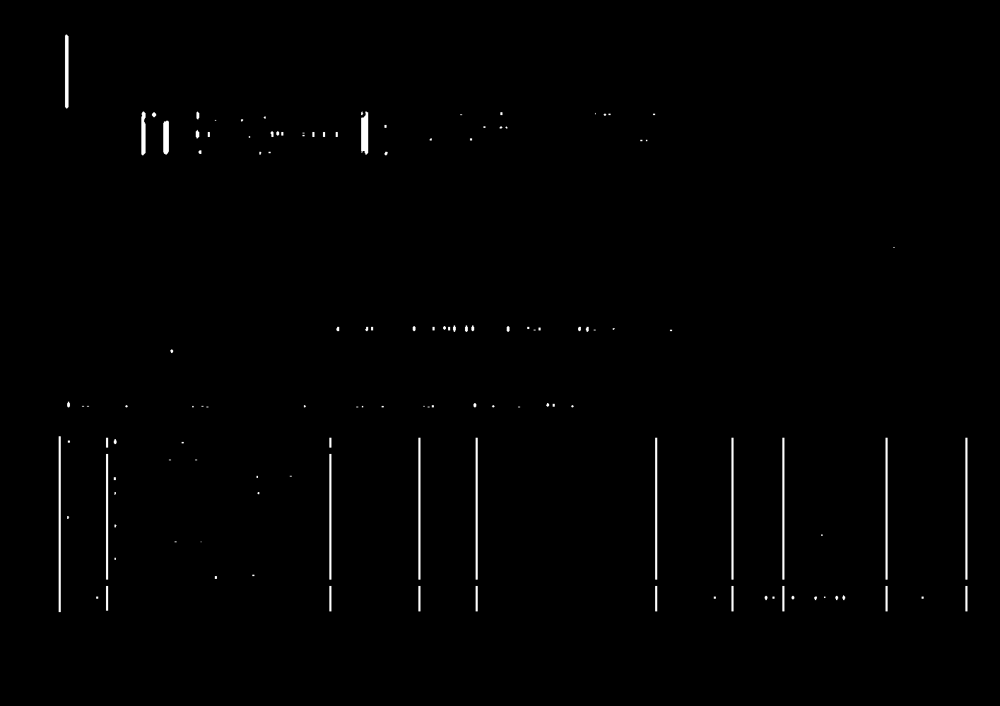
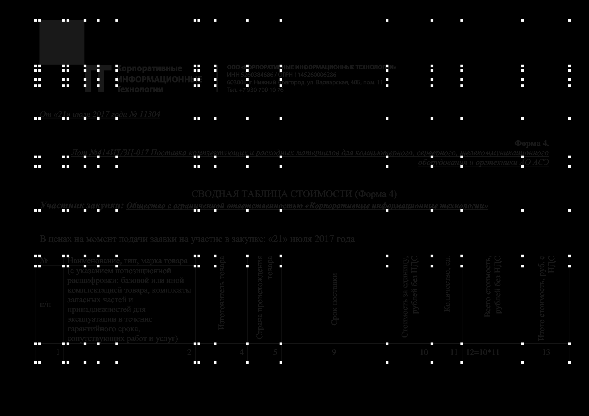
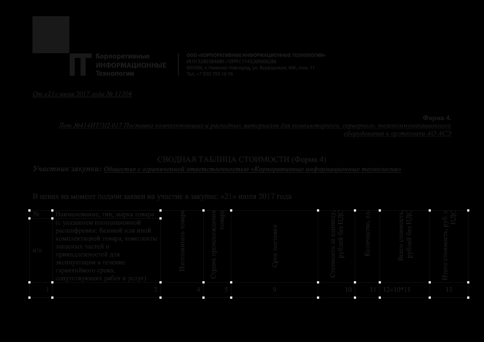
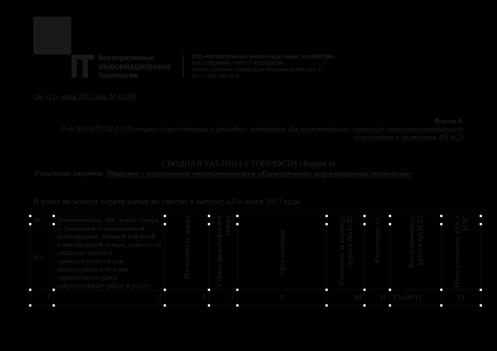

# Ho Chi Minh

## Overview

Ho Chi Minh is designed to extract textual information from tables presented in PDF, pictures or other format.
If the table is strongly tilted, the data will not be extracted correctly. PDF is transformed into pictures (page by page),
and then each image is processed separately.

The utility ignores the text layer and treats any pdf as a picture.

It is assumed that on one page there is exactly one table, which is not transferred to the next page. If
on the page there are several tables, then most likely the recognition will be incorrect.

Ho Chi Minh City does not know how to work with complex tables, in which several cells are united together:

Then, in the majority of cases, simple tables are correctly recognized:

 

If the table occupies only a small part of the image or does not have
obvious boundaries, then it probably will not be is recognized.

Ho Chi Minh allows to get the frame of the table in the form of a list of cells, each of which is represented by four points
(cell angles). Cell is a class:

    class Cell:
        def __init__(self, x_min=0, x_max=0, y_min=0, y_max=0, prob=0.0, text=''):
            # Coordinates of the cell in the picture
            self.x_min = x_min
            self.x_max = x_max
            self.y_min = y_min
            self.y_max = y_max

            # Probability of correct extraction of cell coordinates
            self.prob = prob
            # Text inside the cell
            self.text = text

To extract the text, you can use the following code:

    templator = TableRecognizer(
            reader=ImageFromPDFReader(
                PDFConverter(in_path=path + 'pdf/', out_path=path + 'pdf/images/', resolution=130)
            ),
            hough_transformer=SobelDirector(),
            connected_components=ConnectedComponents(),
            cross_detector=CrossDetector(max_steps=15, detected_steps=8, line_width=8),
            ocr=TesseractWrapper(),
            binarization=210
        )
        table = []
        for i in range(4):
            table.append(templator.next_points())

# How to install without pip

    apt-get install tesseract-ocr
    apt-get install tesseract-ocr-rus
    apt-get install poppler-utils
    apt-get install make
    make deps

# How to install WITH pip

    apt-get install tesseract-ocr
    apt-get install tesseract-ocr-rus
    apt-get install poppler-utils
    apt-get install make
    pip install hochiminh
    
# Build from source

    apt-get install tesseract-ocr
    apt-get install tesseract-ocr-rus
    apt-get install poppler-utils
    apt-get install make
    git clone https://github.com/Hedgehogues/HoChiMinh
    make deps
    
# Service

If you want to use our application as service, you can use demonstration application. Starting:

    make run
    
We use [fastAPI](https://github.com/tiangolo/fastapi). After that you can go to `http://0.0.0.0:8000/docs` and you can use 
swagger for send requests. 

We have two endpoints: 

* GET status
* POST pdf for parsing

POST request is a very long request. Therefore we set status to local storage and lock another requests. You can do the 
only request. After that you can waiting will finished request and retry another request. You can check request into GET
status request.

Example of response (list of cells of pages):

    {
      "cells": [
        [
          {
            "x_min": 92,
            "x_max": 164,
            "y_min": 661,
            "y_max": 686,
            "prob": 1,
            "text": ""
          },
          {
            "x_min": 164,
            "x_max": 504,
            "y_min": 661,
            "y_max": 686,
            "prob": 1,
            "text": ""
          },
          {
            "x_min": 504,
            "x_max": 639,
            "y_min": 661,
            "y_max": 686,
            "prob": 1,
            "text": ""
          },
          ...
        ]  
      ]    
    } 
    
# Docker

You can use our dockerfile. We recommend to use [docker compose](https://docs.docker.com/compose/):

    docker-compose up
    
Before this, please, installing:
 
    apt-get install docker.io docker-compose
    
After that, you can run docker or docker-compose. You can get service at `http://0.0.0.0:8000/docs`. Notice: building 
docker image is built a so long time. Therefore we prepare docker-image for you.  
    
# NOTICE

If the assembly fails, then there is probably a problem with the dependency versions and you should fix them yourself. 

If you have a problem with openCV, you can study the workpiece for the docker file, which describes how to set 
dependencies for openCV, as well as openCV itself.

## Other objects

HoChiMinh consists of several parts (objects), which it must be initialized. More details about most of these parts can be found in the section ** Algorithm **. There are other objects that are not directly related to the algorithm, but, when this is important enough. This, for example, is the ImagePDFReader class, which provides downloading images from PDF. Its component is the PDFConverter.

PDFConverter processes all files that lie in a specific directory. ImagePDFReader takes one file from the PDFConverter.

## Algorithm

The principle of operation of the algorithm can be described with the help of the following scheme:

* Reader. Reading the next picture from the pool using the reader.
* Detector of Horisontal and vertical lines. The image shows the most obvious and long horizontal and vertical lines.

For each line, its coordinate is memorized (for horizontal lines - $ y $, for vertical ones - $ x $). Then, all 
possible pairs of points $ (x, y) $ are constructed. All of them are candidates for the corners of the cells of the
 table.
 

* Detector the largest connected components. We select the largest (we consider the area of ​​the rectangle in which it
is) a connected component. All candidate points that belong to it are left, we forget about the others.

* Detect cross of table. Some of the points highlighted in the table render superfluous. Some of them lie not at the intersection
parties, and in an arbitrary place on the side of the table. All extra points are deleted.

* Uniques points. As a result of the operation performed in the previous step, only those points that lie in the nodes remain
tables. In this case, in some nodes there are more than 1 point. This stage is aimed at obtaining a single point in each
node.

* Building table. The table is constructed. In connection with the fact that part of the node points $ (x, y) $ may not be
is recognized, we construct a table as the Cartesian product of the set $\{x\}\times\{y\} $. In this case, if some cells
tables were unified, then there is an erroneous recognition.

* OCR. Each cell is considered separately. Recognition is carried out.

## Links

[1] http://www.machinelearning.ru/wiki/index.php?title=Логистическая_функция

[2] http://www.sibran.ru/upload/iblock/0e1/0e15d76aff003e3879db51f21ae7f694.pdf

[3] https://www.osapublishing.org/DirectPDFAccess/0CF96649-F614-A5CD-5F118AF53F660BAB_383046/copp-2-1-69.pdf?da=1&id=383046&seq=0&mobile=no

[4] https://www.hindawi.com/journals/cmmm/2015/607407/

[5] http://research.ijcaonline.org/volume55/number4/pxc3882634.pdf

[6] http://article.sapub.org/pdf/10.5923.j.ajis.20120206.01.pdf

[7] https://pdfs.semanticscholar.org/f07f/ec524e5a6dd08163e9f56599ea712cbd0a31.pdf

[8] https://arxiv.org/abs/1505.04597

[9] https://tyvik.ru/posts/pillow-almighty/

[10] https://www.youtube.com/watch?v=jzZ3WVhgi5w

[11] http://lab.alexkuk.ru/ocr/

[12] https://github.com/ulikoehler/OTR

[13] https://github.com/inuyasha2012/answer-sheet-scan

[14] https://github.com/pavitrakumar78/Python-Custom-Digit-Recognition

[15] https://github.com/enigma-ml/textify

[17] https://www.ph4.ru/fonts_fonts.php?fn=all&l=rus&id=2

[18] https://arxiv.org/pdf/1706.07422.pdf

[19] https://github.com/Belval/pdf2image

[20] https://habrahabr.ru/post/351266/

[21] https://habrahabr.ru/post/181580/

# Other projects

[1] http://tabula.technology/

[2] https://github.com/mpasternak/pdf-table-extractor

[3] https://github.com/DustBytes/PdfTableExtraction

[4] https://github.com/ferhatelmas/docker-pdf-table-extract

[5] https://github.com/jsvine/pdfplumber

[6] https://github.com/tfmorris/pdf2table

[7] https://github.com/ashima/pdf-table-extract

[8] https://github.com/BIDS/agri_tables

[9] https://github.com/BIDS/agri_tables

[10] https://github.com/nsi-iff/pypdf2table

[11] https://github.com/mgedmin/pdf2html

[12] https://github.com/maxbelyanin/pdf-tbl-extract

# Хошимин

## Обзор

Хошимин предназначен для извлечения текстовой информации из таблиц, представленных в PDF, картинках или ином формате.
Если таблица сильно наклонена, то данные извлекутся некорректно. PDF предварительно преобразуется в картинки (постранично),
а затем каждое изображение обрабатывается отдельно.

Утилита игнорирует текстовый слой и рассматривает любой pdf как картинку.

Предполагается, что на одной странице существует ровно одна таблица, которая не переносится на следующую страницу. Если
на странице существует несколько таблиц, то вероятнее всего распознование произойдёт некорректно.

Хошимин не умеет работать со сложными таблицами, в которых несколько ячеек объеденены воедино:

При этом, в большинстве случае корректно распознаются простые таблицы:

Если таблица занимает лишь небольшую часть изображения или же не имеет явных границ, то, вероятно, она не будет
распознана.

Хошимин позволяет получить каркас таблицы в виде списка ячеек, каждая из которых представлена четырьмя точеками
(углы ячейки). Ячейка (Cell) представляет собой класс:

    class Cell:
        def __init__(self, x_min=0, x_max=0, y_min=0, y_max=0, prob=0.0, text=''):
            # Координаты ячейки на картинке
            self.x_min = x_min
            self.x_max = x_max
            self.y_min = y_min
            self.y_max = y_max

            # Вероятность корректного извлечения координат ячейки
            self.prob = prob
            # Текст внутри ячейки
            self.text = text

Для извлечения текстовой можно воспользоваться следующим кодом:

    templator = TableRecognizer(
        reader=ImageFromPDFReader(
            PDFConverter(in_path=path + 'pdf/', out_path=path + 'pdf/images/', resolution=130)
        ),
        hough_transformer=SobelDirector(),
        connected_components=ConnectedComponents(),
        cross_detector=CrossDetector(max_steps=15, detected_steps=8, line_width=8),
        ocr=TesseractWrapper(),
        binarization=210
    )
    table = []
    for i in range(4):
        table.append(templator.next_points())

# How to install without pip

    apt-get install tesseract-ocr
    apt-get install tesseract-ocr-rus
    apt-get install poppler-utils
    apt-get install make
    make deps

# How to install WITH pip

    apt-get install tesseract-ocr
    apt-get install tesseract-ocr-rus
    apt-get install poppler-utils
    apt-get install make
    pip install hochiminh
    
# Build from source

    apt-get install tesseract-ocr
    apt-get install tesseract-ocr-rus
    apt-get install poppler-utils
    apt-get install make
    git clone https://github.com/Hedgehogues/HoChiMinh
    make deps
    
# Сервис

Если вы хотите использовать наше приложение как сервис, вы можете использовать демонстрационное приложение. Начало:

    make run
    
Мы используем [fastAPI](https://github.com/tiangolo/fastapi). После этого вы можете перейти к `http://0.0.0.0:8000/docs`
и вы можете использовать swagger для отправки запросов.

У нас есть две конечные точки:

* GET /status
* POST /parse/pdf

POST-запрос - это очень длинный запрос. Поэтому мы устанавливаем статус в локальное хранилище и блокируем другие 
запросы. Вы можете выполнить единственный запрос. После этого Вы можете дождаться завершения запроса и повторить другой 
запрос. Вы можете проверить запрос в GET /status.

Пример ответа (список ячеек со всех страниц):

    {
      "cells": [
        [
          {
            "x_min": 92,
            "x_max": 164,
            "y_min": 661,
            "y_max": 686,
            "prob": 1,
            "text": ""
          },
          {
            "x_min": 164,
            "x_max": 504,
            "y_min": 661,
            "y_max": 686,
            "prob": 1,
            "text": ""
          },
          {
            "x_min": 504,
            "x_max": 639,
            "y_min": 661,
            "y_max": 686,
            "prob": 1,
            "text": ""
          },
          ...
        ]  
      ]    
    }
    
## Замечение

Если сборка завершается с ошибкой, то, вероятно, проблема с версиями зависимостей и Вам стоит их самостоятельно 
поправить.

Если у Вас возникает проблема с openCV, Вы можете изучить заготовку для докерфайла, где описан способ установки 
зависимостей для openCV, а также самого openCV.
        
## Сопотствующие утилиты

Хошимин состоит из нескольких частей (объектов), которыми его необходимо инициализировать. 
Подробнее, о большинстве из этих частей, можно прочитать в разделе **Алгоритм**. 
Есть и другие объекты, которые не имеют непосредственного отношения к алгоритму, но, при 
этом являются достаточно важными частями. Это, например, класс ImagePDFReader, который
обеспечивает загрузку изображений из PDF. Его составной частью является PDFConverter.

PDFConverter обрабатывает все файлы, который лежат в определённой директории. ImagePDFReader
берёт по одному файлу от PDFConverter.

## Алгоритм

Принцип работы алгоритма можно описать при помощи следующей схемы:

* Reader. Прочтение очередной картинки из пула при помощи ридера.

* Detector of Horisontal and vertical lines. На изображении выделяются наиболее явные и протяжённые горизонтальные и
вертикальные линии.

Для каждой линии запоминается её координата (для горизонтальных - $y$, для вертикальных - $x$). Затем,
строятся все возможные пары точек $(x, y)$. Все они являются кандидатами для углов ячеек таблицы.

* Detector the largest connected components. Выделяем самую большую (считаем площадь прямоугольника, в котором она
находится) связную компоненту. Все точки-кандидаты, пренадлежащие ей, оставляем, про остальные забываем.

* Detect cross of table. Часть точек, выделенных в таблице оказывает излишними. Некоторые из них лежат не на пересечении
сторон, а в произвольном месте на стороне таблицы. На все лишние точки удаляются.

* Uniques points. В результате проведённой операции на предыдущем шаге, остаются лишь те точки, которые лежат в узлах
таблицы. При этом, в некоторых узлах лежит более 1 точки. Данный этап направлен на получение единственной точки в каждом
узле.

* Building table. Производится построение таблицы. В связи с тем, что часть узловых точек $(x, y)$ может быть не
распознано, построим таблицу, как декартово произведение множества $\{x\} \times \{y\}$. При этом, если некоторые ячейки
таблицы были объеденены, то возникает ошибочное распознование.

* OCR. Рассматривает каждая, отдельно взятая ячейка. Производится распознование.

## Ссылки
[1] http://www.machinelearning.ru/wiki/index.php?title=Логистическая_функция

[2] http://www.sibran.ru/upload/iblock/0e1/0e15d76aff003e3879db51f21ae7f694.pdf

[3] https://www.osapublishing.org/DirectPDFAccess/0CF96649-F614-A5CD-5F118AF53F660BAB_383046/copp-2-1-69.pdf?da=1&id=383046&seq=0&mobile=no

[4] https://www.hindawi.com/journals/cmmm/2015/607407/

[5] http://research.ijcaonline.org/volume55/number4/pxc3882634.pdf

[6] http://article.sapub.org/pdf/10.5923.j.ajis.20120206.01.pdf

[7] https://pdfs.semanticscholar.org/f07f/ec524e5a6dd08163e9f56599ea712cbd0a31.pdf

[8] https://arxiv.org/abs/1505.04597

[9] https://tyvik.ru/posts/pillow-almighty/

[10] https://www.youtube.com/watch?v=jzZ3WVhgi5w

[11] http://lab.alexkuk.ru/ocr/

[12] https://github.com/ulikoehler/OTR

[13] https://github.com/inuyasha2012/answer-sheet-scan

[14] https://github.com/pavitrakumar78/Python-Custom-Digit-Recognition

[15] https://github.com/enigma-ml/textify

[17] https://www.ph4.ru/fonts_fonts.php?fn=all&l=rus&id=2

[18] https://arxiv.org/pdf/1706.07422.pdf

[19] https://github.com/Belval/pdf2image

[20] https://habrahabr.ru/post/351266/

[21] https://habrahabr.ru/post/181580/

# Другие проекты

[1] http://tabula.technology/

[2] https://github.com/mpasternak/pdf-table-extractor

[3] https://github.com/DustBytes/PdfTableExtraction

[4] https://github.com/ferhatelmas/docker-pdf-table-extract

[5] https://github.com/jsvine/pdfplumber

[6] https://github.com/tfmorris/pdf2table

[7] https://github.com/ashima/pdf-table-extract

[8] https://github.com/BIDS/agri_tables

[9] https://github.com/BIDS/agri_tables

[10] https://github.com/nsi-iff/pypdf2table

[11] https://github.com/mgedmin/pdf2html

[12] https://github.com/maxbelyanin/pdf-tbl-extract
